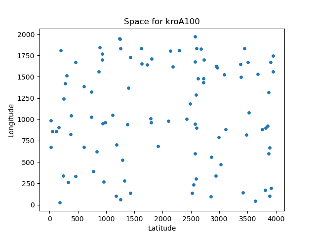
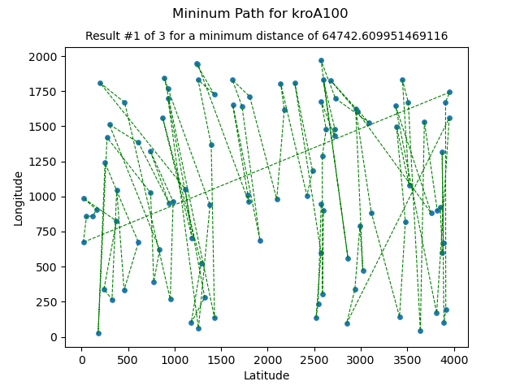
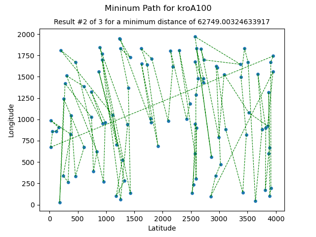
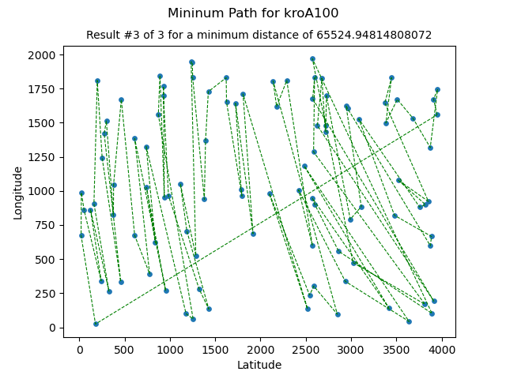
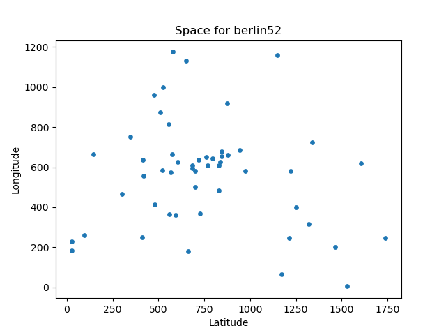
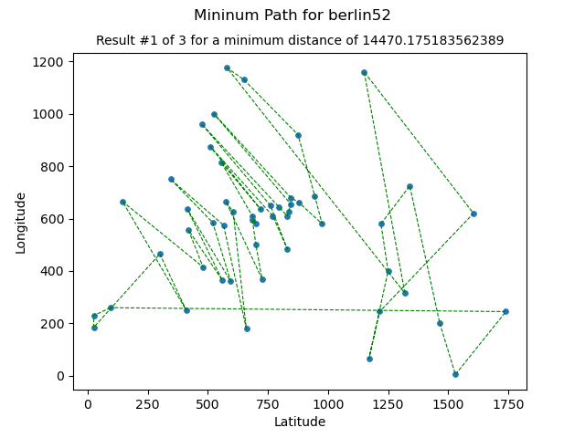
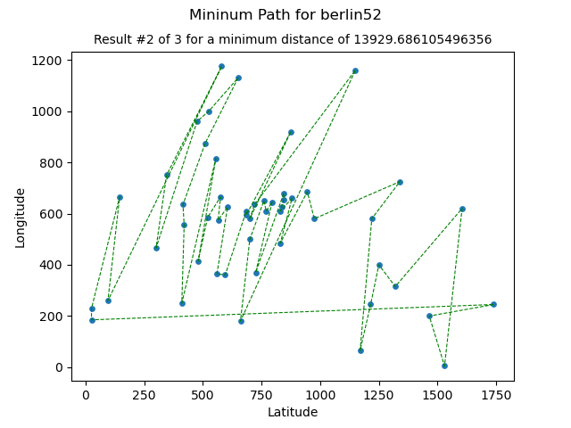

## Implementing Ant Colony Optimization (ACO) algorithm for a given Symmetric traveling salesman problem (TSP)
Taking as data the **The 100-city problem A** [kroA100.tsp](data/kroA100.tsp) by *Krolak/Felts/Nelson* and additional results for **52 locations in Berlin** [berlin52.tsp](data/berlin52.tsp) by *Groetschel*

### Ant Colony Optimization (ACO)
It is an **optimization algorithm** used to find the shortest path between points or nodes. It is developed by observing the behaviour of ants when they follow a path to their food source. Ants are essentially blind so they follow pheromone trails left behind by other ants on the path. This algorithm follows the same approach by using the probability of going to the next node as the distance to the node and the amount of pheromones.

### Symmetric traveling salesman problem (TSP)
Given a set of **n** nodes and distances for each pair of **nodes**, find a roundtrip of minimal total length visiting each node exactly once. The distance from node *i* to node *j* is the same as from node *j* to node *i*.

### Author
Yefferson Marí­n - ([@yammadev](https://github.com/yammadev))

### Requeriments
* [Python](https://python.org)
* [Numpy](https://numpy.org)
* [Matplotlib](https://matplotlib.org)

## Implementation
Check the [Jupiter notebook](aco-tsp.ipynb) with details.

## Results
Generated by [testing.py](testing.py) using [library.py](library.py) and stored [data/*.tsp](data) files. See [results/](results) folder for details.

### [kroA100.tsp](data/kroA100.tsp)
#### Space

#### Minimum path

#### Results
Stored in [results/kroA100-results.txt](results/kroA100-results.txt)

### [berlin52.tsp](data/berlin52.tsp)
#### Space

#### Minimum path

#### Results
Stored in [results/berlin52-results.txt](results/berlin52-results.txt)

## Changelog
All notable changes to this project are documented in this part of the file. The format is based on [Keep a Changelog](http://keepachangelog.com/).

#### [x.y.z] - YYYY-MM-DD
- **x** for major release related to major additions or changes.
- **y** for minor release related to minor additions or changes in current major release.
- **z** for minor release related to minor additions or changes in current minor release.

#### Extras
- **Added** for new features.
- **Modified** for changes in existing functionality.
- **Deprecated** for soon-to-be removed features.
- **Removed** for removed features.
- **Fixed for** any bug fixes.
- **Security** in case of vulnerabilities.

### [2.1.3] - 2020-04-04
#### Modified
- `Readme` edited.

### [2.1.2] - 2020-04-04
#### Modified
- `Readme` edited.

### [2.1.1] - 2020-04-03
#### Added
- `aco-tsp.pdf` with paper version of `Jupiter Notebook`.

#### Modified
- `Jupiter Notebook` little improvements.

### [2.1.0] - 2020-04-03
#### Added
- `aco-tsp.py` executable script exported from `Jupiter Notebook`.
- Code cleaning.  

#### Modified
- `Jupiter Notebook` completed.
- Generated files.
- Sending algorithm data to generated files, to set different values as desired.

### [2.0.0] - 2020-04-03
#### Added
- `ACO_TSP` algorithm completed.
- `berlin52.tsp` file added - `52 locations in Berlin` (Groetschel).
- Testing code that output `x-space.png`, `x-path-x.png` and `x-results.txt` files, and store them in `results/` folder for a given `.tsp` file stored in `data/`.
- Code optimization.
- `Jupiter Notebook` implementation added.

### [1.2.1] - 2020-04-02
#### Modified
- Restructured for better code reading and implementation.

### [1.2.0] - 2020-04-01
#### Added
- Plotting features.

#### Modified
- Better code structure.
- Readme edited.

### [1.1.0] - 2020-04-01
#### Added
- `.tsp` data is readen and displayed.
- Calls from `Jupiter Notebook` file.

### [1.0.0] - 2020-03-31
#### Added
- Initial commit with minimal `Jupiter Notebook` config.
- `kroA100.tsp` file added - the `100-city problem A` (Krolak/Felts/Nelson)
